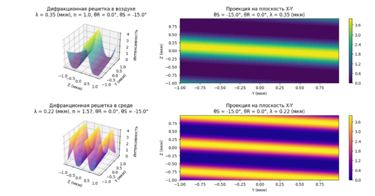

# «Запись, расчет и отображение 3D голографических решеток (θR = 0° и θS= -15°, -25°, -35°)»

## **Оглавление**
[**Исходные данные**](#_toc198407264)

[**Интерференционные картины**](#_toc198407265)

[**Характеристики голографических решеток**](#_toc198407266)

[**3D изображения дифракционных решеток**](#_toc198407267)

[**Заключение**](#_toc198407268)

[**Список литературы**](#_toc198407269)

### **Исходные данные**

1. Сигнальная и референтная волны являются плоскими, монохроматическими и когерентными.
1. Сигнальная волна падает на светочувствительную среду под углом ΩS = -15o, -25o, -35o; референтная волна – под углом ΩR = 0o. Углы отсчитываются от нормали к поверхности среды.
1. Падающие волны распространяются в среде с показателем преломления n1 = 1.
1. Показатель преломления светочувствительной среды – *n*2 = 1,57.
1. Длина волны света в среде с показателем преломления *n*1 равна λ = 0.35, 0.7, 1.5 мкм.
   #### **Задание**
1. Дать описание наклонной (в общем случае) плоской волны в системе координат X, Y, Z;
1. Изложить теорию интерференции двух наклонных плоских монохроматических волн в средах с показателями преломления n1, n2;
1. Получить формулы для вычисления характеристик голографических решеток, формируемых в средах с показателями преломления n1 и n2: пространственной частоты, пространственного периода, угла наклона, угла Брэгга.
1. Получить 3D-изображение голографических  решеток в координатах X,Y,Z и показать их в нескольких пространственных углах поворота (например, относительно оси OY).
1. Отметить наблюдаемые при этом особенности, в том числе при изменении длины волны записывающего излучения.
1. Определить значения параметров решеток в средах с показателями преломления n2 и n1 при заданных углах падения ΩS и ΩR: частоту решеток, период решеток, угол наклона решеток и их углы Брэгга.
1. Указать возможные искажения и шумы решеток в случае применения реальных светочувствительных сред.

### **Интерференционные картины**
#### **Понятие интерференционной картины**
Волновые свойства света были впервые продемонстрированы в 1802 году Томасом Юнгом, который наблюдал интерференцию света, исходящего из двух различных точек волнового фронта. Он обнаружил, что в разных точках экрана, освещенного двумя такими вторичными источниками, может происходить не только взаимное усиление интенсивности света, но и взаимное гашение. Это явление трудно объяснить с точки зрения корпускулярной теории, но его легко понять на основе волновых представлений.

Экспериментальное устройство Юнга для получения интерференции от двух световых источников показано рис. 1.

Рисунок I. Схема опыта Юнга.

Точечное отверстие P0​ освещено параллельным пучком света. Сферическая волна, возникающая при дифракции на отверстии P0, падает на расположенный на некотором расстоянии непрозрачный экран с двумя одинаковыми отверстиями P1 и P2​. Эти отверстия представляют небольшие участки волнового фронта, в результате чего образуются две вторичные согласованные по фазе сферические волны.

На экране S, который помещен параллельно первому экрану, в том месте, где волны перекрываются, наблюдаются чередующиеся светлые и темные интерференционные полосы, расположенные перпендикулярно линии, соединяющей P1​ и P2​.

Получение голограмм тесно связано с методом наблюдения волновых свойств света, поскольку в обоих случаях происходит регистрация интенсивности светлых и темных полос, возникающих при пересечении когерентных световых волн. Пространственное распределение этой интенсивности называется **интерференционной картиной** или **картиной стоячих волн**. Последнее название связано с тем, что распределение полос остается неизменным во времени.

Благодаря этому мы можем:

- Наблюдать интерференционные полосы в эксперименте Юнга;
- Измерять их интенсивность и расстояние между ними.

Образование интерференционных полос доказывает волновую природу света, а анализ их характеристик (расстояния между полосами, контраст) позволяет определить такие параметры, как **длина волны** и **степень когерентности** света.

Создание голограммы по своей сути представляет собой процесс регистрации интенсивности интерференционной картины. Если разность фаз между интерферирующими волновыми полями остается постоянной в течение определенного времени, то пространственное распределение интенсивности полос в интерференционной картине также будет стабильным во времени.

В данном разделе мы рассмотрим распределение интенсивности в такой интерференционной картине, ограничившись случаем интерференции **монохроматических волн** одинаковой частоты, исходящих от единого непрерывного источника излучения. Это соответствует идеализированному условию абсолютно когерентного света, при котором:

- Разность фаз между волнами постоянна,
- Интенсивность интерференционной картины не изменяется со временем.

  Для возникновения интерференционной картины необходимо одновременное присутствие нескольких волн. Рассмотрим процесс сложения монохроматических волн одинаковой частоты. Каждая волна может быть представлена в виде:

  vi= ai\*cos2πft+φi,                              (1)

  где:

- vi - вектор электрического поля в области интерференции;
- ai​ - амплитуда волны;
- f - частота (одинаковая для всех волн);
- φi - фаза волны;

  Сумма таких синусоидальных функций также является синусоидой:

  a1\*cos2πft+φ1+a2\*cos2πft+φ2+…=a\*cos2πft+φ

  Для упрощения расчетов удобно использовать комплексную запись:

  Rea1\*cos2πft+φ1+Rea2\*cos2πft+φ2+…=Re a\*cos2πft+φ,                                (2)

  где Re[ ] обозначает действительную часть комплексного числа. В дальнейших вычислениях символ Re[ ] часто опускают для упрощения записи, подразумевая, что физический смысл имеет только действительная часть.

  Рассмотрим ключевые формулы для анализа комплексной волновой функции. Основные величины:

1. **Комплексный вектор электрического поля**:

   v= a\*eiφ\*e2πift,                (3)

   где:

- a - амплитуда волны;
- φ – фаза;
- *f* - частота колебаний;
- Множитель e2πift описывает временную зависимость
2. **Комплексная амплитуда** (не зависящая от времени):

   a= a\*eiφ

   Её действительная часть a называется просто вектором амплитуды. Для скалярных волн термин "вектор" опускается.

   Опуская символ действительной части Re[ ] и вынося общий множитель , получаем:

   a1\*eiφ1+a2\*eiφ2+…=a\*eiφ= a,         (4)

   **Физический смысл**:\
   Комплексная амплитуда результирующей волны получается как сумма комплексных амплитуд интерферирующих волн по правилам сложения комплексных чисел. Это существенно упрощает анализ интерференционных явлений.

   Таким образом, комплексный вектор амплитуды суммы монохроматических волн получается сложением комплексных векторов амплитуды индивидуальных волн согласно правилам сложения комплексных чисел. 

   #### **Интерференция двух волн**
   Голография обычно имеет дело с интерференцией двух волн: предметной волны и опорной волны. В этом случае интенсивность I принимает вид

   I= a\*a=a1\*a1+a2\*a2+a1\*a2\*ei(φ2-φ1)+e-i(φ2-φ1)

   или

   I=I1+I2+2a1\*a2\*cosφ2-φ1,        (5)

   Таким образом, интенсивность в любой точке интерференционной картины, образованной двумя волнами, является суммой интенсивностей отдельных волн плюс интерференционный член. В этом не зависящем от времени интерференционном члене содержится информация о разности фаз.

   Отметим, что для того, чтобы интерференционный член не был равен нулю, вектор a2​ должен иметь компоненту, параллельную a1. Две световые волны, которые поляризованы во взаимно перпендикулярных направлениях, дают, согласно выражению (5), вклад в интенсивность, равный только сумме интенсивностей, и не могут привести к возникновению ни интерференционной картины, ни голограммы. 

   Из выражения (5) видно, что только параллельные друг другу векторные волновые компоненты могут создать интерференционные картины (или голограммы). При анализе процесса образования голограммы мы можем рассматривать взаимодействующие волновые амплитуды как скалярные величины. Это, конечно, приводит к упрощению записи. 

Рисунок II. Структура интерференционной картины, образующейся при пересечении двух плоских волн.

Далее почти везде будет применяться скалярный волновой анализ.

Пространственное распределение амплитуд и фаз интерференцирующих волн определяет специфический вид интерференционной картины, или картины стоячих волн. В качестве наиболее простого и наглядного примера обратимся к интерференции плоских волн, что понадобится нам в дальнейшем при рассмотрении голографии. Предположим, что плоские волны исходят от одинаковых абсолютно когерентных источников и пересекаются под углом 20. Для таких волн точки постоянной фазы лежат в одной плоскости (плоский волновой фронт).

### **Характеристики голографических решеток**
Дифракционная структура полученной решетки, при записи голограммы на светочувствительном материале, будет прямо зависеть от расположения максимумов и минимумов интерференционной картины. Поэтому необходимо рассмотреть выражение, стоящее под косинусом в формуле (5):

k1-k2r=k1x-k2xx+k1y-k2yy+k1z-k2zz=νxx+νyy+νzz2π=         =1dxx+1dyy+1dzz ,                     (6)

В полученном выражении νi=k1i-k2i2π – пространственная частота решетки вдоль *i* оси координат: *x, y или z*; di=1νi – период решётки.

`	`Направление распространения опорной и предметной волн определяется из закона Снеллиуса по формуле:

n1sinΩ=n2sinψ→ψ=arcsinn1n2sinΩ,                     (7)

где ψ – угол между направлением распространения волны и осью *z* в регистрирующей среде;

Ω – угол между направлением распространения волны и осью *z* в воздухе.

Проекции волновых векторов, приходящих из среды n1 в среду n2 соответственно:

k'z=kn2∙cosψ=kn2∙cosarcsinn1n2sinΩ

k'y=kn2∙sinψ=kn2∙sinarcsinn1n2sinΩ

k'=k'z2+k'y2≠k=kz2+ky2

Из этого следует, что выражение для пространственной частоты имеет вид:

νz(среда)=cosψS-cosψRλ            νz(воздух)=cosΩS-cosΩRλ0  (8)

νy(среда)=sinψS-sinψRλ            νy(воздух)=sinΩS-sinΩRλ0   (9)

А выражение для периода решетки выглядит следующим образом:

dz(среда)=λcosψS-cosψR        dz(воздух)=λ0(cosΩS-cosΩR)   (10)

dy(среда)=λsinψS-sinψR        dy(воздух)=λ0(sinΩS-sinΩR)   (11)

где  <i>λ0</i> – длина волны в воздухе;

λ – длина волны в среде.

Угол наклона периодической структуры *Ф* к поверхности, от которой идёт отсчёт углов можно найти из выражений (10) и (11):

Ф(среда)=dydz=-cosψS-cosψRsinψS-sinψR=ψS+ψr2          Фвоздух=ΩS+Ωr2  (12)

Расстояние между соседними плоскостями пучностей определяются соотношением:

d=1ν=dycosФ,       (13)

Угол Брэгга – это угол к нормали поверхности объёмной голограммы, под которым следует её освещать так, чтобы интенсивность дифрагировавших волн была максимальна. Для этого необходимо, чтобы все волны, претерпевшие перепреломление и переотражение в объёмной периодической структуре, были синфазными в плоскости наблюдения. С помощью закона Брэгга (14) связываются параметры голографической решётки и длины волн освещающих пучков:

2dsinθ=λ0n→n(среда)=arcsinλnсреды12dсреды    θ(воздух)=arcsinλ0nвоз12dвоздуха   (14)

Предельная отстройка от угла Брэгга определяется из соотношения: ∆θ=tgθN~d/l*,* здесь *l –* продольная толщина слоя, длина. N=x/d – число полос в слое с поперечной толщиной x.

На рисунке 2 приведены характеристики голографических решеток: пространственная частота (νy), пространственный период (dy), угол наклона(*Ф*).

Рисунок 3.  Характеристики голографических решеток

Далее приведены формулы, которые использовались в работе для нахождения характеристик голографических решеток в воздухе с показателем преломления <i>n1</i>.

Угол наклона периодической структуры *Ф* к поверхности: Фвоздух=ΩS+Ωr2.

Период решетки: dy(воздух)=λ0(sinΩS-sinΩR).

Пространственный период и пространственная частота: d=1ν=dy(воздух)cosФ(воздух)

Угол Брэгга: θ(воздух)=arcsinλ0n112dвоздуха.

`	`Формулы для нахождения характеристик решеток в среде с показателем преломления <i>n2</i>.

Угол наклона периодической структуры *Ф* к поверхности:Ф(среда)=ψS+ψr2.

Период решетки: dy(среда)=λsinψS-sinψR.

Пространственный период и пространственная частота: d=1ν=dy(среда)cosФ(среда).

Угол Брэгга: θ(среда)=arcsinλn212dсреда.

### **3D изображения дифракционных решеток**
#### **Графики распределения интенсивности и значение параметров решеток**
Необходимо получить и построить 3D-изображения дифракционных решеток в плоскости y-z при заданных значениях углов падения (ΩS и ΩR) интерферирующих плоских волн. Отметить какие закономерности наблюдаются при изменении длины волны.

Ниже представлены объёмные картины распределения интенсивности интерференционной картины двух плоских волн. По этому распределению можно судить о структуре в фотоматериале.

1. Графики распределения интенсивности при ΩS = -15o и ΩR = 0o и с разными длинами волн.

Рисунок III. Распределение интенсивности при ϴS = -15 o, ϴR = 0 o, λ = 0.35 мкм

Таблица 1. Значения параметров решетки при ΩS = -15°, ΩR = 0o, λ = 0.35 мкм

Рисунок IV. Распределение интенсивности при ϴS = -15 o, ϴR = 0 o, λ = 0.7 мкм.

Таблица 2. Значения параметров решетки при ΩS = -15°, ΩR = 0o, λ = 0.7 мкм

Рисунок V. Распределение интенсивности при ϴS = -15 o, ϴR = 0 o, λ = 1.5 мкм.

Таблица 3. Значения параметров решетки при ΩS = -15°, ΩR = 0o, λ = 1.5 мкм

На представленных выше рисунках заметно, что угол наклона решетки не изменяется с длиной волны. С возрастанием длины волны увеличился пространственный период решетки и соответственно уменьшилась пространственная частота.

1. Графики распределения интенсивности при ΩS = -25o и ΩR = 0o и с разными длинами волн.

Рисунок VI. Распределение интенсивности при ϴS = -25 *o*, ϴR = 0 *o*, λ = 0.35 мкм.

Таблица 1. Значения параметров решетки при ΩS = -25°, ΩR = 0o, λ = 0.35 мкм

Рисунок VI. Распределение интенсивности при ϴS = -25 o, ϴR = 0 o, λ = 0.7 мкм.

Таблица 2. Значения параметров решетки при ΩS = -25°, ΩR = 0o, λ = 0.7 мкм

Рисунок VIII. Распределение интенсивности при ϴS = -25 o, ϴR = 0 o, λ = 1.5 мкм.

Таблица 3. Значения параметров решетки при ΩS = -25°, ΩR = 0°, λ = 1.5 мкм

При рассмотрении рисунков с распределением интенсивности при ΩS = -25o, ΩR = 0o угол наклона решетки остается неизменным с увеличением длины волны, но также увеличился пространственный период и уменьшилась пространственная частота. По сравнению с первым случаем, когда ΩS = -15o, ΩR = 0o угол наклона решетки уменьшился, так как разница углов падения сигнальной и референтной волн стала меньше.

1. Графики распределения интенсивности при ϴS = -35° o и ϴR = 0° с разными длинами волн.

Рисунок IX. Распределение интенсивности при ϴS = -35°, ϴR = 0°, λ = 0.35 мкм.

Таблица 1. Значения параметров решетки при ΩS = -35°, ΩR = 0°, λ = 0.35 мкм

Рисунок X. Распределение интенсивности при ϴS = -35°, ϴR = 0°, λ = 0.7 мкм.

Таблица 2. Значения параметров решетки при ΩS = -35°, ΩR = 0o, λ = 0.7 мкм

Рисунок XI Распределение интенсивности при ϴS = -35 o, ϴR = 0 o, λ = 1.5 мкм.

Таблица 3. Значения параметров решетки при ΩS = -35°, ΩR = 0o, λ = 1.5 мкм

Как и в двух предыдущих случаях пространственный период увеличивается с длиной волны, а пространственная частота уменьшается. Так же, с изменением длины волны остается неизменным угол наклона решетки. По сравнению со случаем, когда ΩS = -25o, ΩR = 0o угол наклона решетки увеличился, как и разность углов падения сигнальной и референтной волн. Если сравнивать со случаем, когда ΩS = -15o, ΩR = 0o угол наклона решетки зеркально отразился.

#### **Вывод**
`	`По значениям параметров решеток в таблицах следует, что закономерности, увиденные на полученных рисунках распределения интенсивности, подтвердились численно. Было замечено, что угол Брэгга не зависит от длины волны. Существенный вклад в изменения угла Брэгга вносит пространственный период, который в свою очередь зависит от разности углов сигнальной и референтной волн. Пространственная частота увеличивается пропорционально разности углов падения сигнальной и референтной волн, соответственно период уменьшается.

Так же, были посчитаны характеристики решеток в среде с показателем преломления <i>n2</i>, что означает возможность наличия периодических структур в среде и воздухе.

### **Заключение**
В работе путём компьютерного моделирования в среде «NVIM» на python 3.12 были получены 3D-изображения различных периодических структур, возникающих в результате интерференции 2-х световых пучков на фоточувствительном материале. После построения 3D-изображений и нахождения значений параметров решеток в средах с различным показателем преломления следуют следующие закономерности:

1. Угол наклона периодической структуры не зависит от длины волны, так как определяется только разностью углов падения сигнальной и референтной волн. Например, как показано на рисунках 3, 4 и 5.
1. При увеличении угла наклона сигнальной волны угол наклона решеток увеличивается. Данное изменение можно увидеть на рисунках 6 и 9.
1. Угол Брэгга не зависит от длины волны и изменяется с разностью углов падения сигнальной и референтной волн.
1. Пространственный период решетки прямо пропорционален длине волны, соответственно пространственная частота обратно пропорциональна длине волны.  
1. Пространственная частота увеличивается пропорционально с разностью углов между референтной и сигнальной волнами.
1. Пространственный период уменьшается пропорционально с разностью углов между референтной и сигнальной волнами.

### **Список литературы**
1. Вест Ч. Голографическая интерферометрия // М.: Издательство «Мир», 1982.
1. Кольер Р., Беркахрт К., Лин Л. Оптическая литография // М.: Издательство «Мир», 1973. 
1. Ландсберг Г.С. Оптика // М.: Издательство «ФИЗМАТЛИТ», 2003

